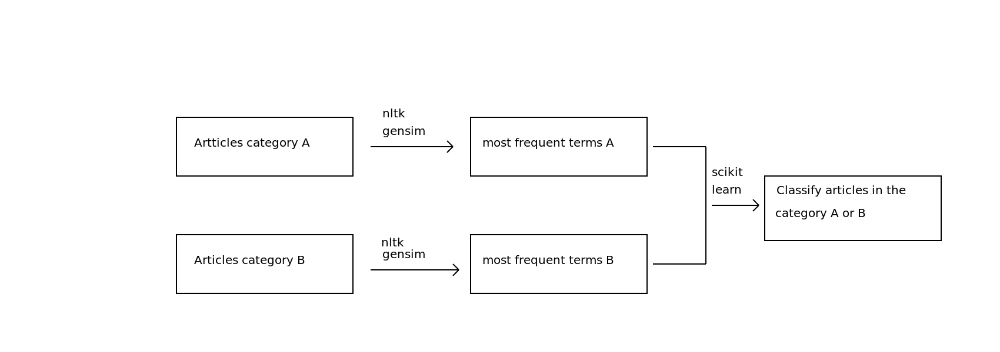

__Aim__:

Help researchers in the bilbiography process. Don't miss interesting/relevant papers!

__Idea__:

Get meaning from scientific articles content and classify new articles.

__Tools__:

IPython/Jupyter notebook, Python 2, Matplotlib, Gensim, Scikit-learn.

__Data__:

I used [eLife Sciences](http://elifesciences.org/) articles found on [Github](http://github.com/elifesciences/elife-articles) and now in my `elife-articles/` directory.

__Project__:

1) I parsed the xml articles using Beautiful Soup library. 

Had a few unicode induced nightmares :-/ but I've been told it'll get better once I (finally) move to Python 3.

I chose to focus on articles only marked with the topic "Cell biology" or "Neuroscience" for my two categories A and B (see diagram above).

2) I extracted terms/topics representative of each category. 

I used LSI (Latent Semantic Indexing) first and then was recommanded to try LDA (Latent Dirichlet Allocation). 
For both models I used Gensim library.

3) I trained a NB (naive Bayes) classifier and a KNN (K nearest neighbour) classifier on the data for the "Cell biology" and "Neuroscience" articles. 

I tried to classify a new article on the presence or absence of certain terms returned as most frequents by the LSI model.

There weren't much difference between the NB and KNN classifier.

While the accuracy was quite high (> 80%) looking at the precision and recall showed the prediction was biased towards the category that had the highest number of data in the training set.

=> I need more data!

__Slides__:

This project was presented at PyData London 2015 and PyCon UK 2015 conferences.
Here are the latest [slides](http://nbviewer.jupyter.org/format/slides/github/Eleonore9/get-articles-meaning/blob/master/notebooks/Eleonore_PyCon_UK2015.ipynb).

-------------

 This work is licensed under a <a rel="license" href="http://creativecommons.org/licenses/by-nc/4.0/">Creative Commons Attribution-NonCommercial 4.0 International License</a>.

